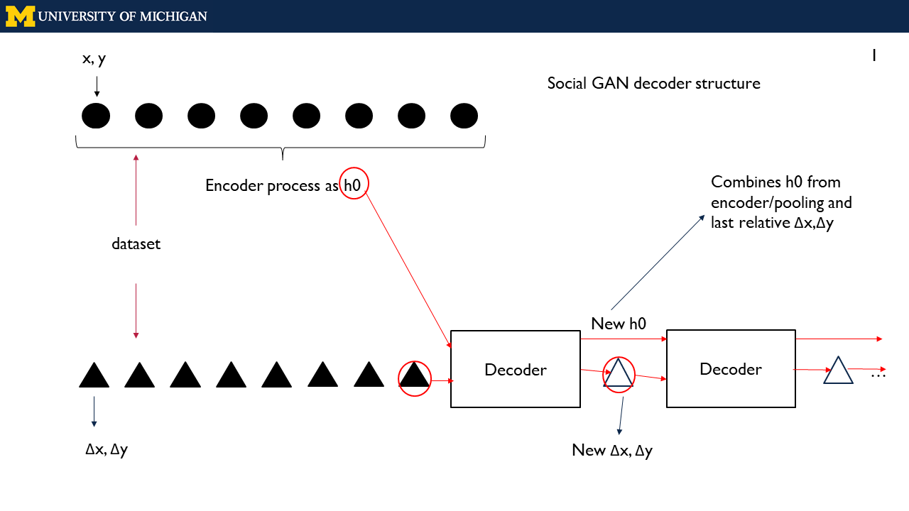
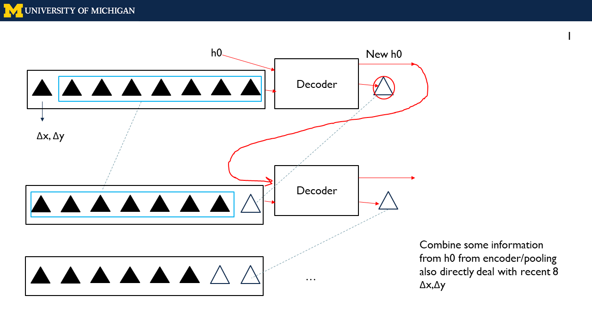

# Social-GAN-modifications
Social GAN is from https://github.com/agrimgupta92/sgan.

I just made several modifications for our research project where there is a multiagent-attacker-defender-battle environment.

Inside the Social GAN data process, I extract the demand positions as environment parameters with defenders and attackers being agents. So the Pooling Module is modified to deal with demands positions purely.

I modified the Decoder part of the Generator. The upper one is the original one where it generates the next relative position based on the one right before; the bottom one is what I change the model inspired by the forecasting of stock trend.

</img>
</img>

Visualization is modified from https://github.com/marsmarcin/Visual-of-Social-GAN, where I change the cases/situations picking up mechanism.

Data processing only meet the requirements of the datasets created by Automotive Research Center, 
University of Michigan.

The forecasting_sample dataset is from Argo.

